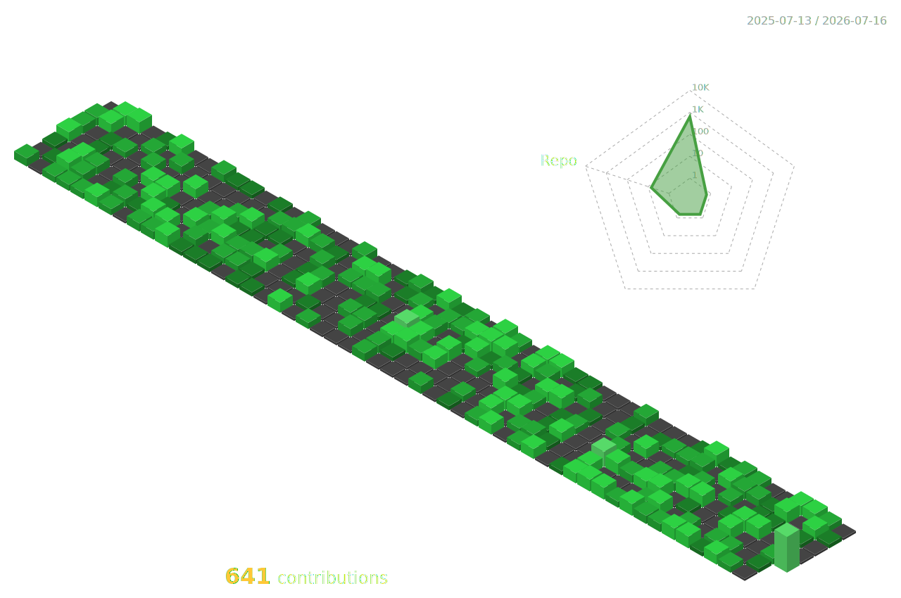

  

  

 

  

 

  

 

## ⚡ Tech Stack & Arsenal

  
**Frontend** 

  

**Backend & ML** 

  

**Infrastructure & Databases** 

 

## 🚀 Featured Engineering

- **[ThreatScope AI](https://github.com/script-ing/ThreatScope)**: An enterprise-grade Cybersecurity Threat Intelligence platform built on Next.js, Python FastAPI, and PostgreSQL with a PyTorch anomaly detection engine.
- **[AutoUploaderV1](https://github.com/script-ing/AutoUploaderV1)**: High-performance headless web scraper and automation architecture handling concurrent Node.js request pools.
- **[0day-0day-RE](https://github.com/script-ing/0day-0day-RE)**: Advanced reverse-engineering of game menu interfaces decoupled into core state components.
- **[BitBuffer-System](https://github.com/script-ing/BitBuffer-System)**: Low-level bit serialization and persistent data caching architecture built in Lua for maximum I/O performance.

  

